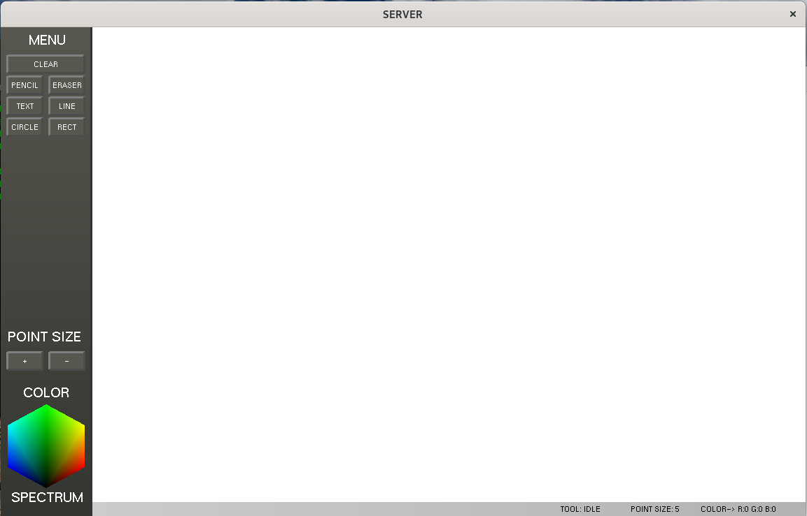

# Real-Time Collaborative WhiteBoard

Created a Collaborative WhiteBoard Using OpenGL and socket Programming in C.

Usage
  -gcc Server.c -lglut -lGL -lGLU -lm -pthread -o Server
  -gcc Client.c -lglut -lGL -lGLU -lm -pthread -o client

